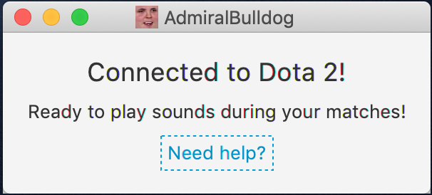

# AdmiralBulldog Sounds

[](https://travis-ci.org/MrBean355/dota2-integration)

This is a little app that plays various [AdmiralBulldog](https://www.twitch.tv/admiralbulldog) sound bytes for things that happen in your Dota 2 matches: 
- 15 seconds before the bounty runes spawn
- your Hand of Midas comes off cooldown
- you become affected by Smoke of Deceit
- you get a kill (33% chance)
- you die (33% chance)
- you get healed (33% chance)
- the match starts
- your team wins
- your team loses
- randomly every 5 to 15 minutes

## Setup
1. Close Dota 2.
2. Navigate to your Dota 2 installation folder (e.g. `C:\Program Files (x86)\Steam\steamapps\common\dota 2 beta`).
3. Within there, navigate to `game\dota\cfg\gamestate_integration` (create any folders that don't exist).
4. Create a new file called `gamestate_integration_bulldog.cfg`.
5. Open the file in a text editor.
6. Paste this content:
    ```
    "AdmiralBulldog Sounds"
    {
        "uri"           "http://localhost:12345"
        "timeout"       "5.0"
        "buffer"        "0.1"
        "throttle"      "0.1"
        "heartbeat"     "30.0"
        "data"
        {
            "provider"      "1"
            "map"           "1"
            "player"        "1"
            "hero"          "1"
            "abilities"     "1"
            "items"         "1"
        }
    }
    ```
7. Save & close the file.

## Testing Your Setup
1. Open this app.
2. Open Dota 2.
3. Enter Hero Demo Mode.
4. If you see this screen, you're ready to go:
    
5. If the app doesn't show the above screen after entering Hero Demo Mode, carefully go through the setup steps again.

## Sound Byte Config
Each of the 10 different sound byte types can be configured to play your choice of sounds.
For example, you can change the bounty rune sound byte from "ROONS!" to "Team Pepega".

Unfortunately there's no nice user interface for configuring the sounds (yet), so you'll have to edit a text file.
1. After running the app for the first time, a `config.json` file will be created.
2. Close the app.
3. Open `config.json` in any text editor.
4. Find the line of the sound byte you want to change (e.g. `"onBountyRunesSpawn"` for changing the bounty rune sound byte).
5. The line will have a pair of square brackets (`[ ]`), which contain a list of possible choices. You can change the list within the square brackets. Please be sure to keep the syntax correct:
    1. Disable the sound byte: `"onBountyRunesSpawn": []`
    2. Only a single sound byte choice: `"onBountyRunesSpawn": [ "ROONS" ]` (names are wrapped in double quotations)
    3. Multiple sound byte choices: `"onBountyRunesSpawn": [ "ROONS", "TEAMPEPEGA", "WTFF" ]` (separated by a comma; no comma after the last name)
6. A list of all possible sound bytes can be found & tried out [here](http://chatbot.admiralbulldog.live/playsounds).
7. Once you're done editing the file, save & close it.
8. The app can be opened again.

## Updates
Over time, there will hopefully be new versions of this app which either fix bugs or add new features.
It's recommended to keep up-to-date to always have the latest AdmiralBulldog pepega.

The app will check for a newer version on startup, and display a message with a link to download the latest version.

## Contact
Feel free to open an issue on this GitHub repository (preferred), or direct-message me (`@Mr_Bean`) on AdmiralBulldog's Discord server.