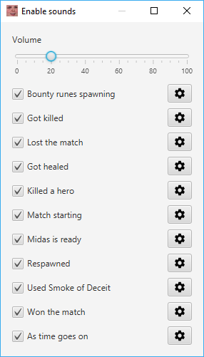
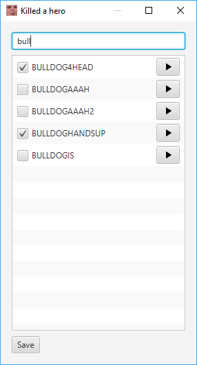

# AdmiralBulldog Sounds

[](https://travis-ci.org/MrBean355/dota2-integration)

This is a little app that plays various [AdmiralBulldog](https://www.twitch.tv/admiralbulldog) sound bytes for things that happen in your Dota 2 matches: 
- shortly before the bounty runes spawn
- your Hand of Midas comes off cooldown
- you get affected by Smoke of Deceit
- you get a kill (sometimes)
- you die (sometimes)
- you get healed (sometimes)
- you respawn
- the match starts
- your team wins
- your team loses
- randomly every 5 to 15 minutes

You can toggle each of these events on and off to your liking.
You can also easily choose which sounds are played for each of these events.
It is designed to have the same selection of sounds as on AdmiralBulldog's official [PlaySounds](http://chatbot.admiralbulldog.live/playsounds) page.

## Installation

#### Download
1. Download the `.jar` file for the [latest release](https://github.com/MrBean355/dota2-integration/releases).
2. Move the downloaded file to somewhere easy to access (e.g. on your desktop).

#### Dota 2 Setup
1. Important: close Dota 2.
2. Navigate to your Dota 2 installation folder (e.g. `C:\Program Files (x86)\Steam\steamapps\common\dota 2 beta`).
3. Within there, navigate to `game\dota\cfg\gamestate_integration` (create any folders that don't exist).
4. Create a new file called `gamestate_integration_bulldog.cfg`.
5. Open the file in a text editor.
6. Paste this content:
    ```
    "AdmiralBulldog Sounds"
    {
        "uri"           "http://localhost:12345"
        "timeout"       "5.0"
        "buffer"        "0.1"
        "throttle"      "0.1"
        "heartbeat"     "30.0"
        "data"
        {
            "provider"      "1"
            "map"           "1"
            "player"        "1"
            "hero"          "1"
            "abilities"     "1"
            "items"         "1"
        }
    }
    ```
7. Save & close the file.

#### Test Your Setup
1. Open the app by double-clicking the downloaded `.jar` file.
2. Note that a `config.json` file is created which stores your settings. If you move or delete this file, all of your settings will be lost!
3. Open Dota 2.
4. Enter Hero Demo Mode.
5. If you see this screen, you're ready to go:<br/>

6. You can also trigger one of the events mentioned above to hear the sound (e.g. use Smoke of Deceit). 
7. If the app doesn't show the above screen after entering Hero Demo Mode, carefully go through the setup steps again.

## Choose The Sounds
Each of the sound byte events can be configured to play your choice of sounds.
For example, you can change the bounty rune sound byte from "ROONS!" to "Team Pepega".

Simply start the app and click the "Change sounds" button.
From there, you can enable or disable certain sound byte events by un-checking the corresponding checkbox.



The volume can be adjusted using the slider. 

Click the settings cog next to a sound byte event to choose which sounds can be played for that event.
When that event happens, one of the selected sounds will get randomly chosen to be played.



Remember to click "Save" when you're done choosing sounds!

## Updates
The most common reason for new versions of this app is that new sound bytes have been added to the [PlaySounds](http://chatbot.admiralbulldog.live/playsounds) page.
It's also likely that bugs get be fixed or new features are added. It's recommended to keep up-to-date to always have the latest AdmiralBulldog sound bytes.

The app will check for a newer version on startup, and display a message with a link to download the latest version.

## Contact
Feel free to open an issue on this GitHub repository, or join my [Discord server](discord.gg/V6JzdJ5) and drop me a message (`@Mr_Bean`)!